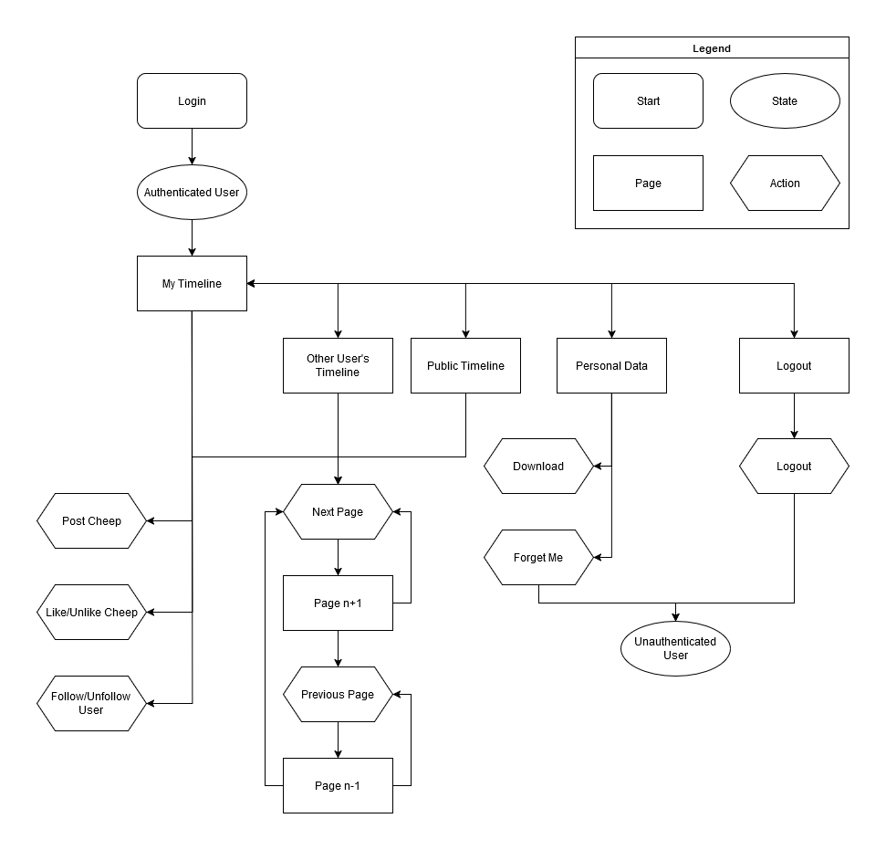

# Design and Architecture of Chirp\!
## Domain model

## Architecture — In the small

## Architecture of deployed application

## User activities

Illustration of the user journey of an unauthenticated user

Illustration of the user journey of an authenticated user

## Sequence of functionality/calls through Chirp\!

# Process

## Build, test, release, and deployment

We have 3 different workflows that relate to the building, testing, releasing and deployment of the program. Two of these workflows activate when changes are pushed to the main branch. Our “Build and Test” workflow builds and runs the unit and integration tests, giving us a clear view of which tests work and which don’t. Meanwhile, our “Build and Deploy” builds the program and then deploys it to the Azure Web Service. We also have a workflow for new releases, which builds and perform all the tests, and then makes a new release by zipping the program files.

## Teamwork

### Unresolved issues

The only issue still unresolved is making all Playwright tests succeed. We have managed to run all different tests with no failures, but this is not a guaranteed outcome. For the tests to work, the database has to be in a specific state. 

Firstly, the database must be in its initial state, with a specific user added, as a lot of Playwright tests depend on certain messages being on the first page. The added user needs to have the username: hans, the email: [hans@grethe.com](mailto:hans@grethe.com) and the password: Abc123456789. Secondly, we have no control over the order in which they run, so if the register user test is not completed, any test that uses this user will fail. Thirdly, if Playwright deletes a user while performing tests you become unable to register a new user in the actual program after the tests have completed. We could not fix this bug because we couldn’t recreate it. 

If we had more time, we would attempt to get these tests to work by perhaps making one big test, where we would have full control over when certain operations were completed. We would also try to dependency inject a new database where we know the state of the database.   

### Development process

When a new issue is added, the process of resolving the issue starts by assigning a developer to the issue. This developer will then make a new branch from main to resolve the issue. Once the issue is resolved, the Main branch is pulled to our new branch to fix any potential merge conflicts. After ensuring that all tests work, we would then pull our branch to main, close the branch, and resolve the issue.

## **Running Chirp Locally**

### **Cloning the repository**

To run Chirp locally, you must start by cloning the project to your computer. This can be done by going to the program’s GitHub page, clicking the green `<> code` button. Then you can copy the web URL, which would be:

[https://github.com/ITU-BDSA2024-GROUP3/Chirp.git](https://github.com/ITU-BDSA2024-GROUP3/Chirp.git)

You can then either use GitHub Desktop, and click `clone repository`, which can be found under `File`. The link can then be used to clone the repository. Another option is to open a terminal in the folder you wish to clone the repository, then using the following command to clone it:

`git clone https://github.com/ITU-BDSA2024-GROUP3/Chirp.git`

### **Running the program**

To run the program locally on your computer, you will likely need developer tools like dotnet. Once you have the necessary programs installed, you can use this command on a terminal in the root of this repository:

`cd ./src/ChirpWeb`

That will take you to the ChirpWeb folder in the terminal, where the program should be run from. One can then use dotnet to run the program locally, which will start a web server you can access through a link the program will provide. The command to use is as follows:

`dotnet run --launch-profile "https"`

Then one can click on the localhost link, and be taken to the page. The page will start on the public page. Note that should you wish to log in as Helge or Adrian, your username will be the same as your actual name, so Helge's profile has the username Helge, and Adrian's profile has the username Adrian.

Another thing to note is that currently if your username on GitHub is the same as existing user, the program will crash. We know this error will occur, but have been told by Helge that it should be ignored.

## **Test cases**

### **How to run the test cases**

To run test cases, you should return to the root of this repository. There you can use this command to run all tests.

`dotnet test`

Note that if you do not have Playwright installed on your computer, all Playwright tests will fail, but integration and unit tests will still complete.

### **The types of tests we have**

We have 15 unit tests, which are all collected under the `Chirp/test/UnitTest` directory. Unit tests are made to test the functionality of CheepRepository and AuthorRepository. Specifically, there exist tests for most methods in the repositories.

We have 152 integration tests, which are all collected under the `Chirp/test/IntegrationTest` directory. These integration tests focus on testing the resulting web pages by checking for the presence of specific elements.

We have 10 End2End tests, which are all collected under the `Chirp/test/PlaywrightTests` directory. PlaywrightTests test whether the program works as a whole, combining frontend and backend. In other words, it tests the functionality of the deployed web server. In the tests, a test user is created to navigate the web page and use all of its functionalities.

# Ethics

## License

We chose the MIT license because of how open and simple it is. We feel the nature of an open source program is well in the spirit of learning, as well as forwarding this ethos to projects that would want to further develop on this software. It also removes the burden of responsibility from us, the authors, when it comes to warranty and liability.

## LLMs, ChatGPT, CoPilot, and others

A few group members have used ChatGPT during development as a last resort after research failed to provide a solution. ChatGPT was never used to develop new features, but only when we found ourselves stuck with a stubborn error. When using ChatGPT, group members would find themselves examining all the code or solutions ChatGPT provided until something, if anything, resolved the issue. Often, the responses were helpful to a degree, but not always. Usually when the responses were helpful, it would be because a single line contained a function call or variable that we missed in the documentation, which proved vital in fixing the error we were working with. This means that quantity-wise, we did not get much code from ChatGPT, which also means that ChatGPT did not interfere with our understanding of the program. 

The use of ChatGPT also proved to speed up the development process of the Chirp program, since it helped fix the errors and bugs that prevented us from continuing development. In conclusion, the use of ChatGPT did not hinder our understanding of the program, and it was useful in speeding up our development, by allowing us to overcome bugs and errors faster.